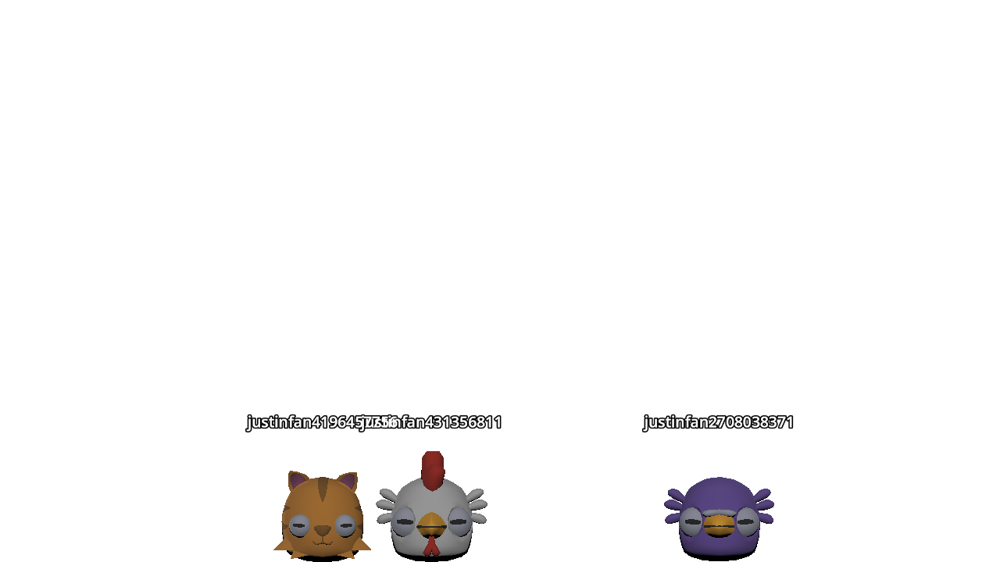

# Twitch Chat Reactions

This is a simple stream overlay, that can visualize the current chatters on the stream.

No authorization or OAuth token is needed on twitch.tv, the application uses the public IRC connection over websocket.

Also it's simple to [add a new character](./docs/adding-new-characters.md).

## Configuration

- Channel: The name of the twitch channel.
- User timeout: The amount of time in seconds, before the character dies for the inactive chatter.
- User color: On Twitch the user can configure the color of the name in the chat. If this configuration is active, the color will be used as the label color of the character.
- Display scale: The size of the characters on the screen.
- Character: Here some models can be enabled/disabled for the usage as a character.

## Features

- Chatters become a random character and fall into the screen.
- If the chatter doesn't write any message for the configured amount of time, the character will die.
- If the chatter writes a message, the character will do a jump animation.
- In the time between, the character will wander around randomly.
- By pressing <kbd>F12</kbd> an overlay will be enabled/disabled (only if the tool is started) for testing the characters.
- The settings can be changed on the fly, by pressing <kbd>ESC</kbd>.

---

- [LICENSE](./LICENSE.md)
- [CREDITS](./CREDITS.md)
