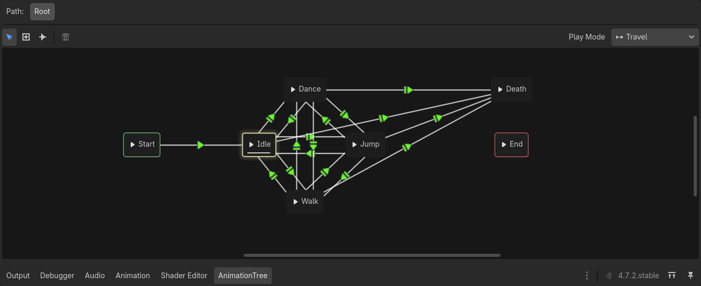

# Adding new characters

For adding a new character you must create a new inherited scene of the [Character-Scene](../characters/character.tscn).
After inheriting the scene, build your character as usual and configure the "AnimationTree" node with a "AnimationNodeStateMachine" as "Tree Root", with this kind of configuration:

Also every transition needs the corresponding condition:

- dancing
- death
- idle
- jumping
- walking

Now your new character scene is ready to use by adding a new entry in the "CharacterList" resource, this resource is attached to the [Main-Scene](../main.tscn).

If this step is done, after starting the application you should see the new entry in the settings menu.
